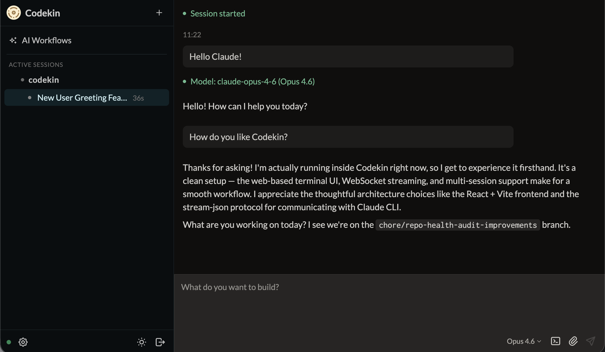

# Codekin

[](LICENSE)
[](https://www.npmjs.com/package/codekin)

**[codekin.ai](https://codekin.ai)**

**A workbench for serious AI coding.**

Codekin is a self-hosted platform for [Claude Code](https://github.com/anthropics/claude-code), [Codex](https://github.com/openai/codex), and [OpenCode](https://opencode.ai) that adds persistent sessions, parallel workspaces, structured approvals, and workflow orchestration — so your team can run AI coding at scale.

```bash
curl -fsSL https://codekin.ai/install.sh | bash
```

Install once, then open from any browser. Codekin runs your coding agents and reaches your repositories **on the computer where you install it**; open it there, or from any device through a Codekin web app — the public instance at [app.codekin.ai](https://app.codekin.ai) or [one you host yourself](docs/SELF-HOSTED-RELAY.md). See [Getting started](docs/GETTING-STARTED.md) for a first-session walkthrough and troubleshooting.



## Why teams choose Codekin

Works with Claude Code, Codex, and OpenCode. More durable than the CLI alone, more controllable than SaaS platforms.

- **Multi-agent support** — Run Claude Code, Codex, OpenCode, and Grok Build side by side with a consistent interface for sessions, approvals, and workflows.
- **Self-hosted control** — Keep data and runtime on your infrastructure. Fits into your existing auth, networking, and deployment stack.
- **Built-in orchestration** — Combine live sessions with scheduled workflows, webhooks, and CI-driven runs in one platform.

## Features

Everything you need to run AI coding in production. Interactive where you work. Structured where it matters. Automated where it repeats.

### Interactive workbench

- **Use it from any device** — Open Codekin from desktop or mobile. No SSH hops or terminal tied to one machine. Reach your computer through a Codekin web app ([app.codekin.ai](https://app.codekin.ai) or [your own](docs/SELF-HOSTED-RELAY.md)) with a one-line install-and-pair, QR device linking and passkey sign-in; the computer connects outbound only, so no ports are opened. Responsive layout with touch-sized controls on phones and tablets
- **Persistent sessions** — Refresh, disconnect, or restart without losing work. Sessions survive across reconnects
- **Session history** — All session transcripts are stored locally. Search, replay, and reference past work without relying on a third party; archived sessions can be re-activated
- **Diff view** — See exactly what changed in each session with an inline diff viewer. Review agent edits before approving; staged and unstaged changes, with per-file discard
- **Built-in file browser** — Inspect project files and Markdown directly in the session view without switching tools
- **Structured approvals** — Review and manage approvals in a clear UI. Audit and revoke with full history, with a permission mode selector, per-session tool pre-approvals, and `--dangerously-skip-permissions` for sandboxed environments
- **Repo browser** — Auto-discovers Git checkouts under your repositories root (flat `~/repos/project` or `~/repos/owner/project`), no GitHub CLI required; with an authenticated `gh`, lists your GitHub repos and clones the rest on demand
- **Command palette, skills and uploads** — `Ctrl+K` to search repos, sessions, skills, docs and actions; browse and invoke each repo's `/skills` with slash-command autocomplete; drag, drop or paste screenshots for the agent to read
- **Color themes** — Nine themes (Dark, Light, Midnight, Paper, High Contrast, Solarized Light, Dracula, Gruvbox, Matrix), each tested against contrast floors

### Orchestration & automation

- **Parallel workspaces** — Run multiple sessions across repos simultaneously, each with its own isolated context
- **Git worktree support** — Each session runs in its own worktree, so agents work on isolated branches without stepping on each other
- **Orchestrator agent** — A coordinator agent (Agent Joe) that plans and delegates work across repos, breaking large tasks into parallel sessions. Runs on any supported agent with its own Codekin MCP server, and is resilient by design: blocked-child notifications, a persistent notification outbox, pausable child timeouts, and ground-truth completion verification
- **Scheduled workflows** — Run recurring checks and repo tasks on a schedule using workflow definition files (Markdown), alongside loops and Agent Joe's runs in one Automations view. An activity-aware trigger engine decides what runs, and a trigger log explains why each run did or didn't fire
- **Loops** — Durable outcome loops that run a coding agent until your own build, test and lint commands pass, within turn, cost and time budgets. A second provider reviews the diff, every step is an auditable event, runs survive restarts, and a passing run is committed, pushed and opened as a PR. Ships with CI Autorepair, Coverage Increase and Dependency Upgrade recipes
- **GitHub CI integration** — Route CI failures from GitHub into Codekin sessions with context already attached, and review pull requests automatically via webhooks
- **Deployment & host monitoring** — Probes for your deployments and host (health, error rate, learned p95 latency, TLS), with breaches diagnosed by Agent Joe and a weekly digest

### Open platform

- **Claude Code, Codex & OpenCode** — Works with Claude Code, Codex, and OpenCode. Pick the right agent per session from one interface, and hand a running session to another agent with its context. OpenCode reaches any LLM provider; Codex brings ChatGPT-subscription OpenAI models; new Claude models appear automatically; subscription and API-key auth both work; live health indicators let you disable or enable each agent
- **Open source** — Full source available. Fork it, extend it, and wire in your own skills and automation
- **Self-hosted** — Run on your infrastructure with full control over data, networking, and configuration — including [your own Codekin web app](docs/SELF-HOSTED-RELAY.md) under your domain and GitHub sign-in
- **Teams and workspaces** — Invite people into a workspace by link, give them a role (owner, admin, member, viewer), share individual sessions with per-user permissions, and require two-factor authentication (authenticator app, passkey, recovery codes)

## Use cases

Built for real engineering workflows:

1. **Daily AI coding workbench** — Keep long-running sessions alive across repos and resume instantly after interruptions.
2. **Parallel work across repos** — Run multiple sessions on different repos simultaneously, each with isolated context.
3. **CI failure triage** — Route failed GitHub CI runs into Codekin sessions with context attached for faster debugging.
4. **Automated PR review** — Use scheduled workflows and GitHub triggers to handle repeatable review tasks automatically.
5. **Shared team context** — Capture repo guidance, reusable skills, and approval history so each session starts with context.
6. **Webhook-driven runs** — Connect webhooks, CI pipelines, and internal automation to trigger AI coding sessions.

## Get started in minutes

### Remote access

Codekin runs coding agents on your own computer; a Codekin web app is how you reach them from a browser, phone or tablet. Use the public instance at [app.codekin.ai](https://app.codekin.ai), or run your own for your team — on your domain, with your own GitHub sign-in and data. See [Hosting your own Codekin web app](docs/SELF-HOSTED-RELAY.md).

1. Install and sign in to at least one supported coding agent on your macOS or Linux computer: [Claude Code](https://github.com/anthropics/claude-code), [Codex](https://github.com/openai/codex), [OpenCode](https://opencode.ai), or [Grok Build](https://github.com/xai-org/grok-build). Windows isn't supported yet.
2. Open your Codekin web app ([app.codekin.ai](https://app.codekin.ai), or your team's own) and sign in with GitHub. Access is by invitation: open the invite link a workspace owner or admin sent you, then sign in. Owners and admins set up two-factor authentication (an authenticator app or a passkey) on first sign-in.
3. On **Connect your computer**, copy the generated install command and run it in a terminal **on that computer**. It pairs the computer with the web app you generated it in, whichever instance that is. The pairing command expires after 10 minutes and can be used once.
4. Wait for the computer to show **online**, then click **Open**. Keep the computer awake and connected while using Codekin remotely.
5. Use **New** to choose a repository and a coding agent. Local Git checkouts under `~/repos` appear automatically; the GitHub CLI is optional for listing and cloning GitHub repositories.

Only need Codekin on the computer in front of you? Use the local install below — no web app involved.

### Install (local)

**Prerequisites:**
- macOS or Linux
- Node.js v20+ (the install script can install this via nvm)
- At least one supported coding agent CLI, installed and authenticated:
  - [Claude Code CLI](https://github.com/anthropics/claude-code) (`claude`)
  - [OpenAI Codex CLI](https://github.com/openai/codex) (`codex login`) to use ChatGPT-subscription OpenAI models
  - [OpenCode](https://opencode.ai) with a configured provider
  - [Grok Build](https://github.com/xai-org/grok-build) (`grok login`, or `XAI_API_KEY`). Agent Joe and workflows don't run on Grok yet

**One-liner:**

```bash
curl -fsSL https://codekin.ai/install.sh | bash
```

This will:
1. Install Node.js 20+ if needed (via nvm)
2. Check for a supported coding agent CLI (installation stops with instructions if none is found)
3. Install the `codekin` npm package globally
4. Generate a local access token and install and start a background service
5. Print your local access URL

Open the printed `http://localhost:32352/#token=...` URL **on the installed computer**. The token is in that URL; (after `#`, so it never reaches server logs); if you open the address without it, paste it on the **Settings → Connection** page, which opens automatically. Run `codekin token` to print the URL again. For another device, use a Codekin web app (see remote access above) rather than a `localhost` link.

The installer checks GitHub CLI (`gh`) but does not require it. Existing local Git checkouts work without GitHub authentication. Continue with [your first session](docs/GETTING-STARTED.md#3-start-your-first-session).

## Usage

```bash
codekin token                   # Print your access URL at any time
codekin config                  # Update API keys and settings
codekin service status          # Check whether the service is running
codekin service install         # (Re-)install the background service
codekin service uninstall       # Remove the background service
codekin start                   # Run in foreground (for debugging)
codekin stop                    # Stop the running background service
codekin setup --regenerate      # Generate a new auth token
codekin upgrade                 # Upgrade to latest version
codekin uninstall               # Remove Codekin entirely
```

## Upgrade

```bash
codekin upgrade
```

This checks npm for the latest version, installs it, and restarts the background service if running. An in-app banner tells you when a newer version is available.

Alternatively, re-run the install script:

```bash
curl -fsSL https://codekin.ai/install.sh | bash
```

## Uninstall

```bash
codekin uninstall
```

This removes the background service, config files, and the npm package.

## Configuration

The installed service reads environment variables from `~/.config/codekin/env`. Edit that file to override defaults, then apply changes with `codekin service install`. The local access token is stored separately in `~/.config/codekin/token`; keep it private.

| Variable | Default | Description |
|---|---|---|
| `PORT` | `32352` | Server port |
| `REPOS_ROOT` | `~/repos` | Root directory scanned for local repositories |

You can also change **Repositories Path** in **Settings → Sessions** or on the first-session screen without restarting the service. See [Getting started](docs/GETTING-STARTED.md#no-repositories-appear).

## Manual / Advanced Setup

For the installation internals and manual deployments, see [Installation and distribution](docs/INSTALL-DISTRIBUTION.md). For nginx and Authelia deployment, see the [advanced setup guide](docs/SETUP.md).

## Contributing

Contributions are welcome! Please see [CONTRIBUTING.md](CONTRIBUTING.md) for guidelines.

## License

[MIT](LICENSE)
